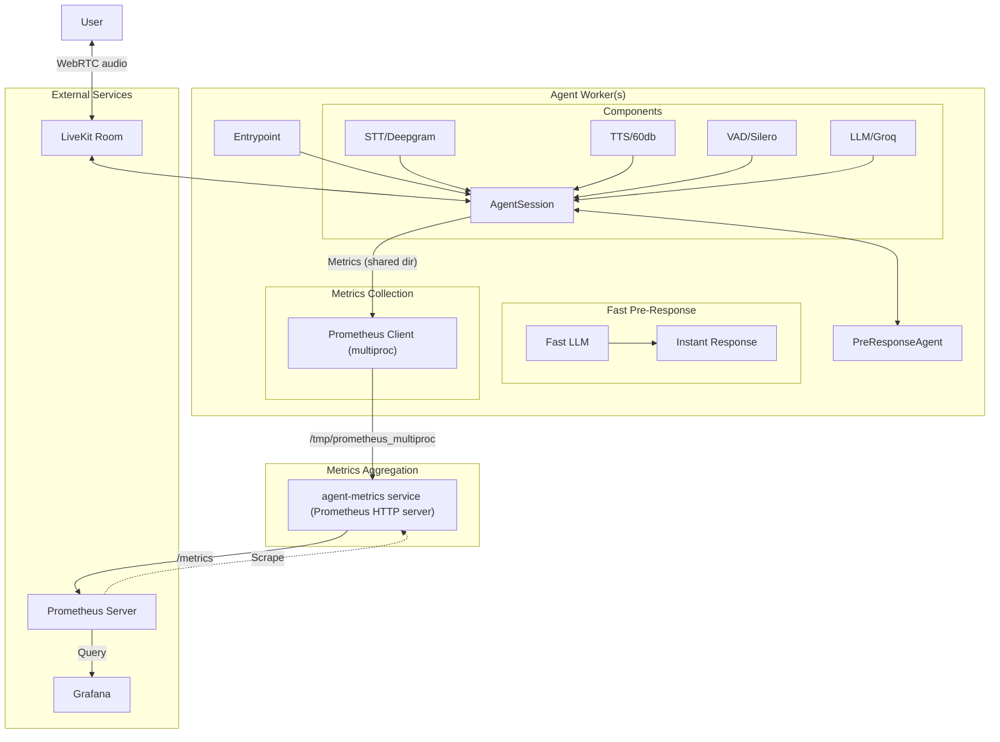

# agent-worker

A real-time voice agent implementation using LiveKit, featuring fast pre-response capabilities and comprehensive metrics collection. Here we implement the logic for the voice AI worker to explore different functions:
- fast-preresponse.py

This example uses Llama 3.1 8B and 70B. Initial quick response comes from 8B to optimize latency, and then the 70B takes over to handle the complex task.
- fast-preresponse-ollama.py

Same idea but using open source services that you can run locally: Llama through [Ollama](https://ollama.ai), Whisper through [speaches](https://github.com/speaches-ai/speaches) and [Kokoro TTS](https://huggingface.co/hexgrad/Kokoro-82M) instead of Groq, OpenAI or others.

## Run with Docker

1. Build the Docker image:
```bash
docker build -t agent-worker .
```

2. Create a `.env` file with your API keys like in [`.env.example`](.env.example).

3. Run the container:
```bash
docker run --env-file .env -p 9100:9100 agent-worker
```

## Run without Docker with conda

1. Create and activate a conda environment:
```bash
conda create -n agent-worker python=3.10
conda activate agent-worker
```

2. Install dependencies:
```bash
pip install -r requirements.txt
```

3. Create a `.env` file with your API keys (same as Docker setup)

4. Run the agent:
```bash
python fast-preresponse.py
```


## Architecture

The agent-worker system is designed for real-time voice AI with fast pre-response and comprehensive metrics. The updated metrics delivery flow is as follows:

- **Agent Worker(s)**: Each worker collects metrics using the Prometheus Python client in multiprocess mode, writing to a shared directory (`/tmp/prometheus_multiproc`).
- **Agent-Metrics Service**: Aggregates all metrics from the shared directory and exposes them at `/metrics` via a Prometheus HTTP server.
- **Prometheus**: Scrapes metrics from the agent-metrics service.
- **Grafana**: Visualizes all metrics by querying Prometheus.



## Components

- **PreResponseAgent**: Main agent implementation with fast pre-response capabilities
- **Metrics Collection**: Comprehensive metrics tracking for:
  - LLM usage and latency
  - STT processing
  - TTS generation
  - VAD detection
  - End-of-utterance detection
  - Cost tracking
- **Fast Pre-Response**: Quick acknowledgment system using a smaller LLM model

## 60db TTS Integration

The two cloud agents (`basic.py`, `fast-preresponse.py`) use **[60db](https://docs.60db.ai)** for
text-to-speech via a custom LiveKit TTS plugin, while keeping **Deepgram** for speech-to-text.

60db is **not** a built-in LiveKit plugin, so it is implemented as a self-contained plugin in
[`sixtydb_tts.py`](./sixtydb_tts.py) that conforms to the `livekit.agents.tts.TTS` interface — the
same interface the built-in `deepgram`/`groq` plugins implement. It can be dropped straight into
`AgentSession(tts=...)`.

### How it works

- **Transport:** 60db **WebSocket streaming API** (`wss://api.60db.ai/ws/tts`), authenticated with the
  `apiKey` query parameter.
- **Audio:** `LINEAR16` (16-bit signed little-endian PCM, mono) at 24 kHz — raw PCM that LiveKit
  consumes directly with no client-side decoding.
- **Protocol:** `create_context` → (per sentence) `send_text` + `flush_context` → reads `audio_chunk`
  (base64 PCM) until `flush_completed`. Text is split into sentences so audio starts streaming before
  the LLM finishes its full response.
- **Reliability:** a fresh WebSocket is opened per utterance and always torn down, so a user barge-in
  (interruption) cleanly stops 60db synthesis/billing and audio never bleeds between turns. Audio is
  also filtered by `context_id`.
- **Metrics:** TTS Prometheus metrics are now labeled `provider="60db"` (previously mislabeled
  `openai`). Update any Grafana TTS panels that query `provider="openai"`.

### Configuration

Set these in your `.env` (see [`.env.example`](.env.example)):

```bash
SIXTYDB_API_KEY="sk_live_..."                 # required — your 60db API key
SIXTYDB_VOICE_ID="<voice_id UUID>"            # required — list voices via GET https://api.60db.ai/myvoices
# SIXTYDB_BASE_URL="https://api.60db.ai"      # optional — override the API base URL
```

Get a `voice_id` by calling `GET https://api.60db.ai/myvoices` with your API key, e.g.:

```bash
curl -H "Authorization: Bearer $SIXTYDB_API_KEY" https://api.60db.ai/myvoices
```

### Usage in code

```python
from sixtydb_tts import TTS as SixtyDBTTS

session = AgentSession(
    stt=deepgram.STT(),     # speech-to-text stays on Deepgram
    tts=SixtyDBTTS(),       # reads SIXTYDB_API_KEY / SIXTYDB_VOICE_ID from env
    # tts=SixtyDBTTS(voice_id="...", speed=1.0, stability=50, similarity=75, sample_rate=24000),
    ...
)
```

Constructor options: `voice_id`, `api_key`, `sample_rate` (8000/16000/24000/48000), `speed` (0.5–2.0),
`stability` (0–100), `similarity` (0–100), `base_url`. All except `api_key`/`voice_id` have sensible
defaults; `api_key` and `voice_id` fall back to the environment variables above.

To revert an agent back to Groq TTS, swap `tts=SixtyDBTTS()` for the commented-out
`tts=groq.TTS(model="playai-tts", voice="Arista-PlayAI")` line.

### 60db STT (optional, alongside Deepgram)

A 60db **speech-to-text** plugin is also available in [`sixtydb_stt.py`](./sixtydb_stt.py) as a
drop-in alternative to Deepgram. **Deepgram remains the default** in both agents; 60db STT is wired
in as a commented-out option.

60db STT is a **REST, file-upload (batch)** API (`POST /stt`), not a live websocket. The plugin
implements the non-streaming `stt.STT` interface; because the agents already run a Silero **VAD**, the
framework automatically wraps it with a `StreamAdapter` that slices mic audio into utterances and
transcribes one utterance at a time. This works for a real-time agent but is **higher latency** than
Deepgram's streaming STT — so Deepgram is recommended for live use, and 60db STT is best when you want
a single 60db account for both TTS and STT.

To enable it, comment out the Deepgram line and uncomment the 60db one:

```python
from sixtydb_stt import STT as SixtyDBSTT

session = AgentSession(
    # stt=deepgram.STT(),
    stt=SixtyDBSTT(),                 # reads SIXTYDB_API_KEY from env
    # stt=SixtyDBSTT(language="en", diarize=False),
    tts=SixtyDBTTS(),
    vad=silero.VAD.load(...),         # required — VAD drives utterance chunking
    ...
)
```

It reuses `SIXTYDB_API_KEY` (no extra key needed). Options: `language` (`"auto"` or ISO 639-1 code),
`diarize`, `api_key`, `base_url`.

## Metrics

The agent collects and exposes the following metrics:

- **Latency Metrics** (Gauge):
  - `livekit_llm_duration_ms`: LLM processing time in milliseconds
  - `livekit_stt_duration_ms`: STT processing time in milliseconds
  - `livekit_tts_duration_ms`: TTS generation time in milliseconds
  - `livekit_eou_delay_ms`: End-of-utterance delay in milliseconds
  - `livekit_total_conversation_latency_ms`: Total conversation latency in milliseconds

- **Usage Metrics** (Counter):
  - `livekit_llm_tokens_total`: Total LLM tokens processed (prompt and completion)
  - `livekit_stt_duration_seconds_total`: Total STT audio duration in seconds
  - `livekit_tts_chars_total`: Total TTS characters processed
  - `livekit_total_tokens_total`: Total tokens processed
  - `livekit_conversation_turns_total`: Number of conversation turns
  - `livekit_active_conversations`: Number of active conversations

- **Cost Metrics** (Gauge):
  - `livekit_llm_cost_total`: Total LLM cost in USD
    - Prompt tokens: $0.01 per 1K tokens
    - Completion tokens: $0.03 per 1K tokens
  - `livekit_stt_cost_total`: Total STT cost in USD
    - $0.0001 per second of audio
  - `livekit_tts_cost_total`: Total TTS cost in USD
    - $0.000015 per character

All metrics are collected using Prometheus client library and are exposed through the agent-metrics service. The metrics are collected in real-time and updated as the conversation progresses.

Note: Usage metrics are implemented as Counters to track cumulative usage, while latency and cost metrics are implemented as Gauges to show current values.
